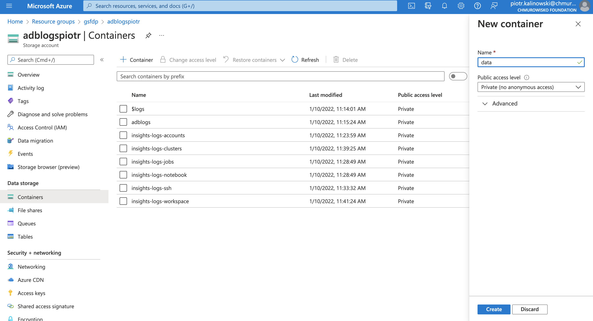
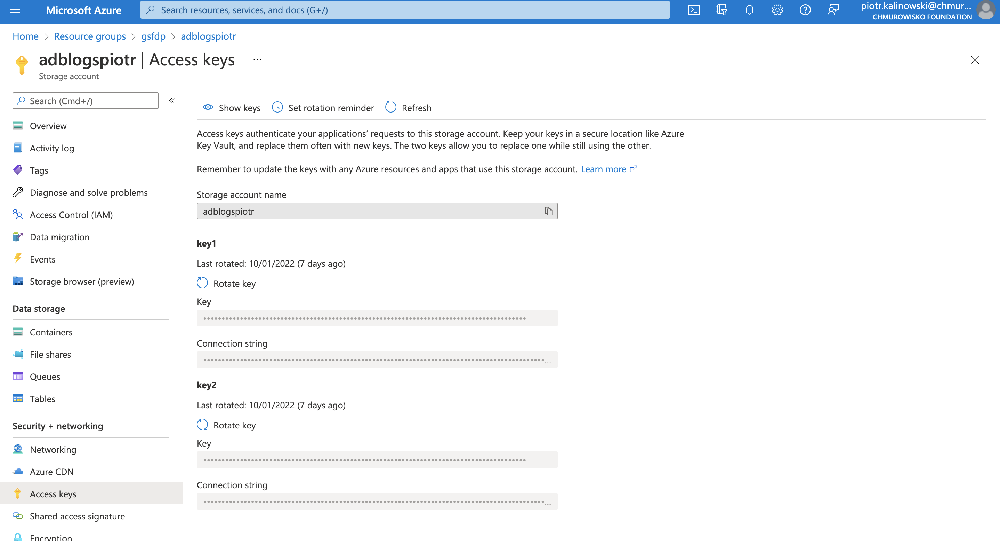
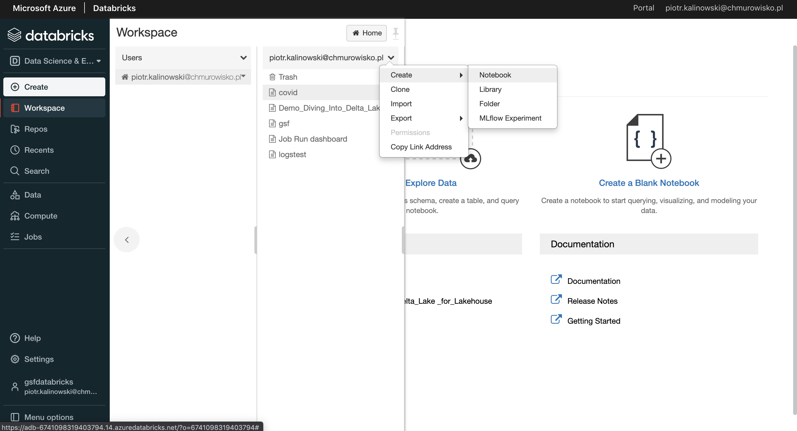
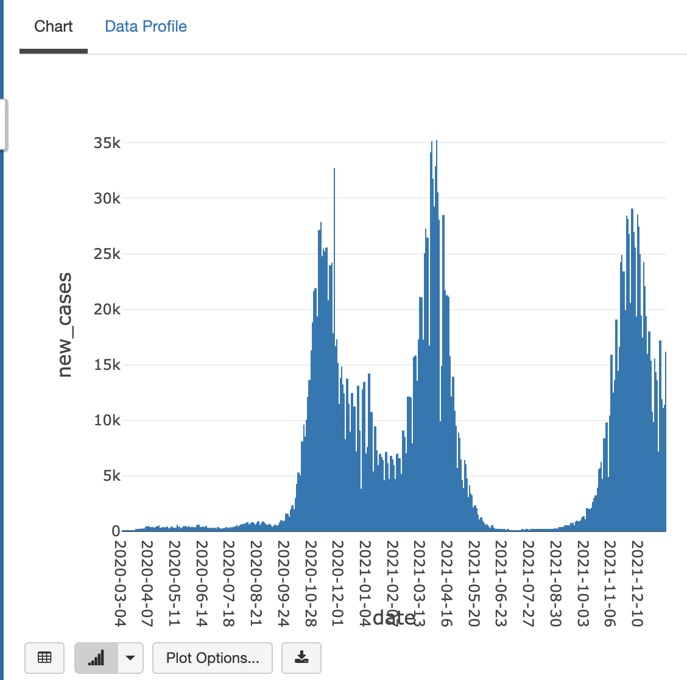
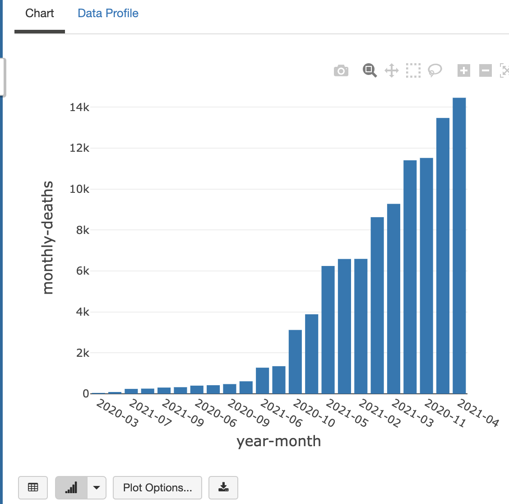
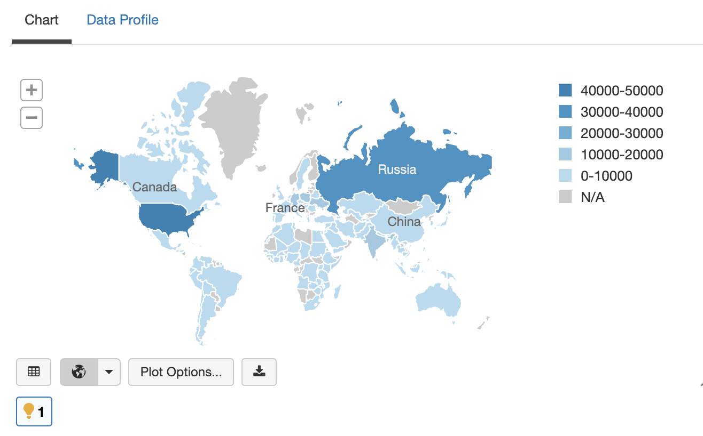

<br><br>
<br><br>
<br><br>

# Working with Spark SQL

## LAB Overview

#### In this lab you will learn how to perform data analysis tasks with Spark SQL.

## Prerequisities:
- access to Databricks workspace
- databricks cluster created
- blob storage account

## Task 1: Connect from Databricks to Azure Storage

In this task your are going to connect databricks to Azure Storage. You will also prepare data file in Azure Blob.

1. Download .csv file on your local machine: `https://raw.githubusercontent.com/owid/covid-19-data/master/public/data/owid-covid-data.csv`
2. Open Azure Portal 
3. Find your Azure Storage Account, go to "blobs" and create new container with name "data" (private container).

4. Upload downloaded .csv file into this container.
5. From left menu click "Access keys". Copy key1 from the panel. You will use it in databricks in order to authenticate to Azure Storage.

6. Open databricks workspace
7. In the left pane, click Workspace. From the Workspace dropdown, click Create, and then click Notebook.

8. Give a name to your notebook, select Python as a language and choose your cluster (make sure the cluster is on).
9. In the first cell past the following code (replace proper placeholders):


```
dbutils.fs.mount(
  source="wasbs://CONTAINER_NAME@STORAGE_ACCOUNT_NAME.blob.core.windows.net",
  mount_point="/mnt/data",
  extra_configs = {"fs.azure.account.key.STORAGE_ACCOUNT_NAME.blob.core.windows.net": "ACCESS_KEY"}
)

# ready solution:
dbutils.fs.mount(
  source="wasbs://data@sannst01.blob.core.windows.net",
  mount_point="/mnt/data",
  extra_configs = {"fs.azure.account.key.sannst01.blob.core.windows.net": "S/xHWqim1DP/mVpixnosvXRwuYOZazG0YtYl3uNLzZlJp063YvWnAGfAA92bTjasTydhmyEkVgCd/AwC/uzvmg=="}
)

```

- STORAGE_ACCOUNT_NAME - name of your storage account
- CONTAINER_NAME - name of the container created in point 3
- ACCESS_KEY - azure storage access key obtained in point 5
10. Execute this command
11. Confirm that the file exists: create new cell and execute: `dbutils.fs.ls("/mnt/data")`

## Task 2. Load Covid-19 data

In this task you will load covid data into Spark dataframe and disp;ay it.

1. In order to create dataframe, Spark needs a data schema. You can either provide this schema manually or Spark can infer this schema automatically. First option is more efficient.
2. Create new cell in notebook and paste schema definition:
```
schema = """
iso_code STRING,
continent STRING,
location STRING,
date DATE,
total_cases FLOAT,
new_cases FLOAT,
new_cases_smoothed FLOAT,
total_deaths FLOAT,
new_deaths FLOAT,
new_deaths_smoothed FLOAT,
total_cases_per_million FLOAT,
new_cases_per_million FLOAT,
new_cases_smoothed_per_million FLOAT,
total_deaths_per_million FLOAT,
new_deaths_per_million FLOAT,
new_deaths_smoothed_per_million FLOAT,
reproduction_rate FLOAT,
icu_patients FLOAT,
icu_patients_per_million FLOAT,
hosp_patients FLOAT,
hosp_patients_per_million FLOAT,
weekly_icu_admissions FLOAT,
weekly_icu_admissions_per_million FLOAT,
weekly_hosp_admissions FLOAT,
weekly_hosp_admissions_per_million FLOAT,
new_tests FLOAT,
total_tests FLOAT,
total_tests_per_thousand FLOAT,
new_tests_per_thousand FLOAT,
new_tests_smoothed FLOAT,
new_tests_smoothed_per_thousand FLOAT,
positive_rate FLOAT,
tests_per_case FLOAT,
tests_units FLOAT,
total_vaccinations FLOAT,
people_vaccinated FLOAT,
people_fully_vaccinated FLOAT,
total_boosters FLOAT,
new_vaccinations FLOAT,
new_vaccinations_smoothed FLOAT,
total_vaccinations_per_hundred FLOAT,
people_vaccinated_per_hundred FLOAT,
people_fully_vaccinated_per_hundred FLOAT,
total_boosters_per_hundred FLOAT,
new_vaccinations_smoothed_per_million FLOAT,
new_people_vaccinated_smoothed FLOAT,
new_people_vaccinated_smoothed_per_hundred FLOAT,
stringency_index FLOAT,
population FLOAT,
population_density FLOAT,
median_age FLOAT,
aged_65_older FLOAT,
aged_70_older FLOAT,
gdp_per_capita FLOAT,
extreme_poverty FLOAT,
cardiovasc_death_rate FLOAT,
diabetes_prevalence FLOAT,
female_smokers FLOAT,
male_smokers FLOAT,
handwashing_facilities FLOAT,
hospital_beds_per_thousand FLOAT,
life_expectancy FLOAT,
human_development_index FLOAT,
excess_mortality_cumulative_absolute FLOAT,
excess_mortality_cumulative FLOAT,
excess_mortality FLOAT,
excess_mortality_cumulative_per_million FLOAT
"""
```
3. Create a spark dataframe from .csv file:
`df = spark.read.csv("dbfs:/mnt/data/owid-covid-data.csv", header=True, schema=schema)`
4. Now you can see the data using `show` function: `df.show()` or in interactive environments (like notebook) you can use `display` function: `display(df)`

## Task 3. Exploratory analysis using Spark SQL

1. First, select just subset of interesting columns:
```
from pyspark.sql.functions import col

df_subset = df.select(["iso_code", "continent", "location", "date", "total_cases", "new_cases", "new_deaths", "new_cases_per_million", "population"])
```
2. Execute the code. Note that execution will be very fast, because for now we don't have any action. Just transformations.
3. Now, filter the results just to polish statistics:
```
poland = df.select(["iso_code", "continent", "location", "date", "total_cases", "new_cases", "new_deaths", "new_cases_per_million", "population"]) \
    .where(col("iso_code") == "POL")
```
4. In a new cell type: `display(poland)`. Now we are executing an action.
5. Using plot options plot how new cases in Poland changed during pandemy:


Play with this chart, you can zoom-in, resize etc. See how new cases decrease each weekend :)

6. Now we want to aggregate some data. Let's create a new column with just a month and year:
```
import pyspark.sql.functions as F
df = df.withColumn("year-month", F.date_format("date", 'yyyy-MM'))
display(df)
```
7. Let's create a simple groupBy transformation:
```
deaths_by_months = df.where(col("iso_code") == "POL") \
    .groupBy("year-month") \
    .count() \
    .orderBy("year-month")
display(deaths_by_months)
```
8. It works, however it is not the case that we need. In fact, this statement counts number of days in a month :)
9. Let's change aggragation function:
```
deaths_by_months = df.where(col("iso_code") == "POL") \
    .groupBy("year-month") \
    .sum("new_deaths")
display(deaths_by_months)
```
10. Now it looks better, however the column name is a little bit ugly. Let's make our statement even better:
```
deaths_by_months = df.where(col("iso_code") == "POL") \
    .where(col("new_deaths").isNotNull()) \
    .groupBy("year-month") \
    .agg(F.sum("new_deaths").alias("monthly-deaths")) \
    .orderBy("monthly-deaths")
display(deaths_by_months)
    
display(deaths_by_months) 
```
here we:
- filter out null values
- group by month and year
- aggregate by sum of "new_deaths" with alias
- order by new aggregation

You should be able to create a chart similar to this:


11.  Ok, now let's take top 10 countries with highest amount of new deaths rate in December 2021:
```
top_10 = df.where(col("year-month") == "2021-12") \
    .groupBy("iso_code") \
    .sum("new_cases") \
    .orderBy(col("sum(new_cases)").desc()) \
    .take(10)

display(top_10)
```
12. We get the results, however the iso codes are not country codes but for example world (OWID_WRL) or Europe (OWID_EUR). 
13. Let's add a new filter and change metric to "new_deaths_per_million":
```
top_10 = df.where(col("year-month") == "2021-12") \
    .where(F.length(col("iso_code")) == 3) \
    .groupBy("iso_code") \
    .sum("new_deaths_per_million") \
    .orderBy(col("sum(new_deaths_per_million)").desc()) \
    .head(10)

display(top_10)
``` 
14. (Check if Poland is in top 10)
15. Now let's take 100 countried with highest population:
```
top_100_largest = df \
    .where(F.length(col("iso_code")) == 3) \
    .where(col("population") > 1000000) \
    .groupBy("iso_code") \
    .avg("population") \
    .orderBy(col("avg(population)").desc()) \
    .limit(100)

display(top_100_largest)
```
16. And take new monthly deaths per month:
```
new_deaths_by_months = df \
    .where(col("new_deaths").isNotNull()) \
    .groupBy("iso_code","year-month") \
    .agg(F.sum("new_deaths").alias("monthly-deaths")) \
    .orderBy("monthly-deaths")

display(new_deaths_by_months)
```
17. Now we can joint two dataframes and see new deaths per month in largest countries in December 2021:
```
joined = top_100_largest.join(new_cases_by_months, top_100_largest.iso_code == new_cases_by_months.iso_code)
display(joined.where(col("year-month") == "2021-12"))
```
18. Draw a map like this:


19. You can also see basic statstics for columns:
```
df.select(["population", "human_development_index"]).summary().show()
```
20. Or count statistics using UI. Call `display(df)` and click "Data Profile" tab.

## Task 4. UDF
1. In a new cell create a UDF definition:
```
def count_country_development(human_development_index):
    if human_development_index < 0.33:
        return "low"
    elif human_development_index < 0.66:
        return "middle"
    else:
        return "high"
```
2. Register the UDF:
```
country_developmentUDF = udf(lambda x: count_country_development(x)) 
```
3. Use the UDF to count new column value:
```
df = df.where(df["human_development_index"].isNotNull())\
    .withColumn("country_development", country_developmentUDF("human_development_index"))
display(df)
```
4. Check if new column exists

## Task 6: SQL
1. Create a temporary view:
```
df.createOrReplaceTempView("coviddata")
```
2. In a new cell execute normal sql query. Note that you need to change cell's default language:
```
%sql
select * from coviddata limit 100;
```
It is called magic command. You can also use %scala, %r, %sh

3. Using bare sql try to draw on the same plot two line: **new_tests** and **new_cases** (for Poland) and see if there is a coleration between these two metrics.

## END LAB

<br><br>

<center><p>&copy; 2019 Chmurowisko Sp. z o.o.<p></center>
